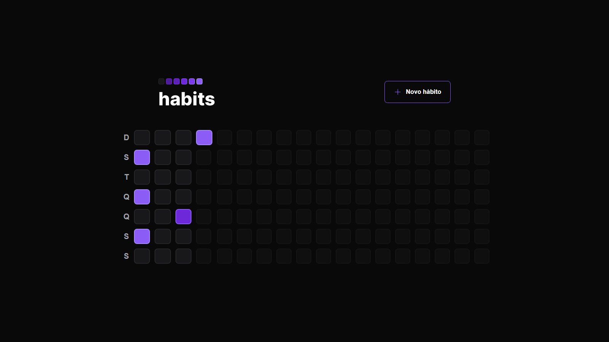
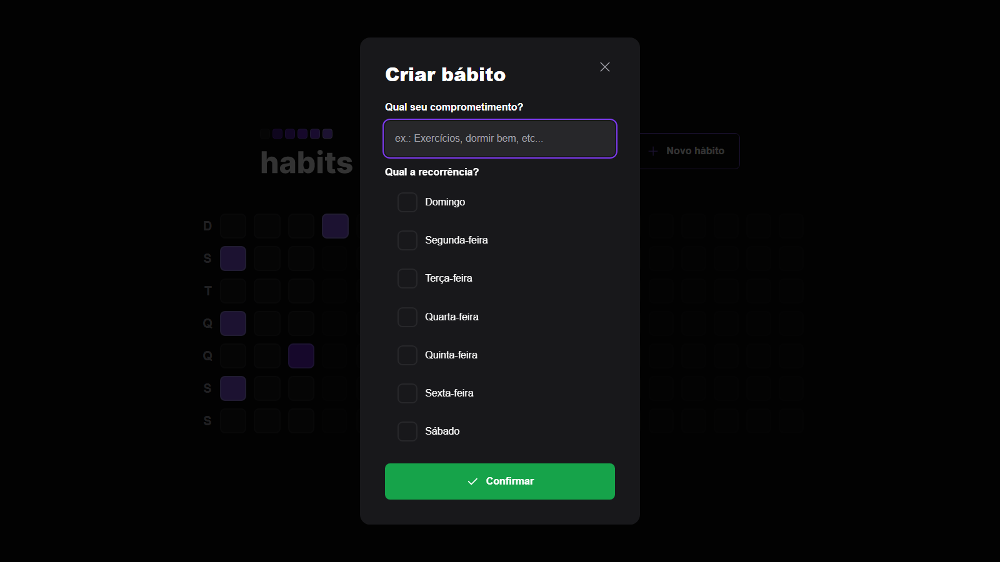

 <p align='center'></p>

 <h1 align="center">NLW Setup</h1>

 <p align='center'>


 
</p>

## 🚀 Tecnologias
Esse projeto está utilizando as seguintes tecnologias:
    

- [React](https://pt-br.reactjs.org/)
- [Node](https://nodejs.org/en/)
- [Typescript](https://www.typescriptlang.org/)  
- [Vite](https://vitejs.dev/)  


## ⚙️ Funcionalidades
- Criar hábitos
- Listar hábitos diários
- Marcar e desmarcar como concluído
- Exibir porcentagem concluída
- Exibir diferentes cores baseado na porcentagem concluída

## 🎲 Como utilizar
### Clone esse repositório
```bash
git clone https://github.com/Savio-Anjos/nlw-Setup.git

```
### Navegue até o diretório server
```bash 
cd server
```

### Instale as dependências
```bash
npm i
```
```bash
yarn
```

### Inicie o servidor
```bash
yarn dev
npm run dev
```

### Navegue até o diretório web
```bash 
cd web
```

### Instale as dependências
```bash
npm i
```
```bash
yarn
```
### Inicie a aplicação Web
```bash
yarn dev
npm run dev
```

## 🖼️ Layout




<p>Criado com 💙 por <a href='https://github.com/Savio-Anjos/' target='_blank'>Sávio Anjos</a></p>

---

<p>Clique aqui para acessar o projeto mobile:<a href='https://github.com/Savio-Anjos/nlw-Setup-mobile' target='_blank'> Mobile</a></p>

---


 
